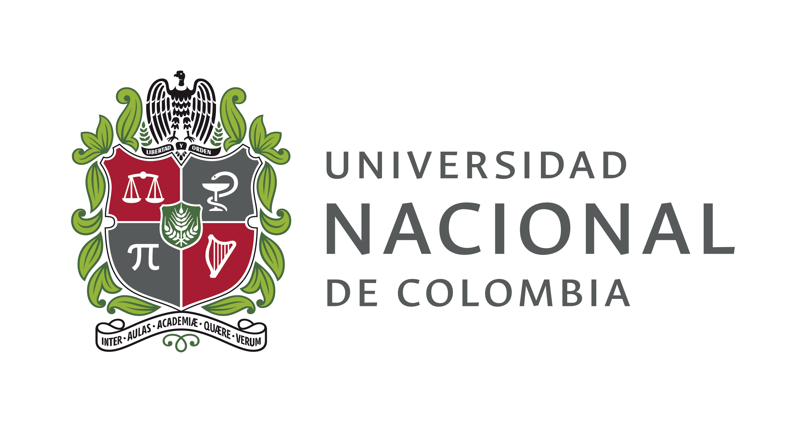

<H1 align="center"> About me </H1>

My name is Sara, I'm an industrial engineer of [Universidad Nacional de Colombia](http://medellin.unal.edu.co/). I´ll start my master's studies in statistics soon and my biggest dream is to become a teacher at my university.

{width=40%}

 

### Education

- [Maestría en Ciencias - Estadística, Universidad Nacional de Colombia (2021).](http://ciencias.medellin.unal.edu.co/escuelas/estadistica/component/progracad/?snies=110263100000500111100&Itemid=164)
- [Ingeniería Industrial, Universidad Nacional de Colombia (2018).](https://minas.medellin.unal.edu.co/formacion/pregrado/ingenieriaindustrial)

 

### Teaching

- 2016-2017
    - Academic monitor Estadística I, Universidad Nacional de Colombia.
- 2018-today
    - Academic advisory of statistics, Logros.

 

### Work experience

- November-December 2018
    - Consulting in design and distribution of plants, Muelles y Frenos Simón Bolívar.
- January-July 2018
    - Engineering internship, Compañía Nacional de Chocolates.

   
